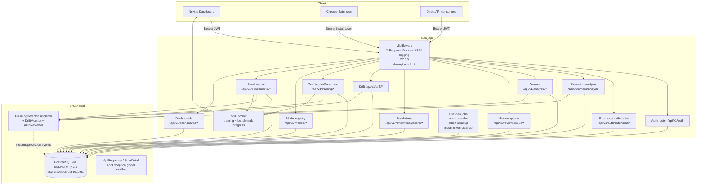
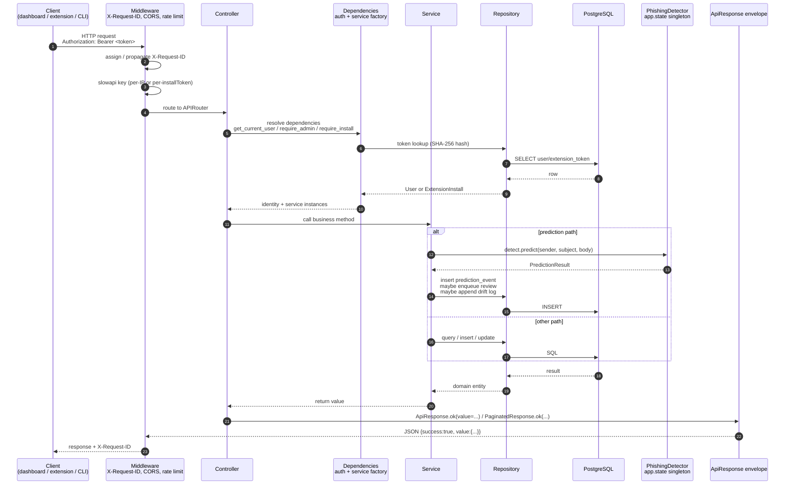

# AURA API

**Adaptive User Risk Analyzer — backend service.**

A FastAPI application that owns every server-side concern of AURA: authentication for both human analysts and Chrome extension installs, on-demand and batch phishing inference, the human review queue, drift telemetry, online-learning training runs, model registry and activation, holdout benchmarking, and the data feeding both dashboards. It is the only repository that talks to the database, the only repository that holds the prediction model in process memory, and the single integration point that the Chrome extension and the Next.js dashboard depend on.

> **Why this is its own repo.** The API contains the regulated surface of the system — auth, PII (sender/subject/body), and the model artefact — and has a deployment cadence that is decoupled from the dashboard's visual iteration and the extension's browser-store release cycle. Keeping it separate lets it be deployed, scaled, and audited on its own schedule without dragging clients along.

---

## Table of contents

- [What this service does](#what-this-service-does)
- [Architecture](#architecture)
- [Project structure](#project-structure)
- [Request flow](#request-flow)
- [Data flow with the rest of AURA](#data-flow-with-the-rest-of-aura)
- [Setup](#setup)
- [Environment variables](#environment-variables)
- [API surface](#api-surface)
- [Architectural conventions](#architectural-conventions)
- [Operations](#operations)
- [Related Repositories](#related-repositories)

---

## What this service does

The API is the centre of AURA. Every other component is a client of it.

- **Auth.** Two parallel auth surfaces — a human-analyst flow (JWT pair, refresh-token rotation, role-based access) for the dashboard, and an install-token flow (Google OIDC verified at register time, opaque random token at rest) for the Chrome extension.
- **Inference.** Loads a `PhishingDetector` from the [`AURA_Model`](https://github.com/kudzaiprichard/aura-model) inference package into application state at startup, and serves single + batch predictions on `/api/v1/analysis/predict*` (dashboard / API consumers) and `/api/v1/emails/analyze` (extension). Predictions are persisted as `prediction_events` rows so they can be reviewed, explained, escalated, and used as drift signals.
- **Review queue.** Predictions whose probability lands in the configured REVIEW zone are enqueued for human (or LLM-backed `auto_reviewer`) adjudication. Review verdicts that disagree with the model become labelled rows in the training buffer.
- **Drift.** Confirmed predictions feed an FPR-tracking drift monitor; the dashboard's drift page reads `/api/v1/drift/*`.
- **Training & models.** Analysts can import labelled data into a training buffer, kick off online-learning runs (`partial_fit`) against a chosen base version, watch the run via SSE, and promote / activate / rollback model versions via the model registry. Uploads can be HMAC-signed and unpickled inside a sandboxed subprocess.
- **Benchmarks.** Holdout datasets can be uploaded and replayed against any registered model version to compute accuracy/precision/recall/F1/ECE.
- **Dashboards.** Two read-models served from `/api/v1/dashboards/{admin,me}`, denormalised on the server so the Next.js dashboard renders without N+1 round-trips.
- **Real-time.** Long-running training and benchmark runs publish progress events through a built-in SSE broker (replay-aware via Last-Event-ID).

---

## Architecture



### Design decisions worth knowing

1. **One FastAPI app, layered modules.** Controllers are thin wrappers that translate HTTP → service calls and build the `ApiResponse` envelope. Services own business logic. Repositories own SQLAlchemy `select(...)`. DTOs (request + response) are Pydantic models with camelCase aliases. This separation is enforced — no service ever touches `Request`, no repository ever touches a DTO.
2. **Two surfaces, no shared prefix.** The dashboard surface (`/api/v1/analysis/...`) and the extension surface (`/api/v1/emails/analyze`, `/api/v1/auth/extension/...`) are intentionally separated by prefix and DTO file (`dtos/extension.py` vs `dtos/{requests,responses}.py`). The extension's wire shape is mostly camelCase but pins a few snake_case fields (`predicted_label`, `model_version`) per `BACKEND_CONTRACT`. The two surfaces never share a path or response shape, so widening one cannot accidentally widen the other.
3. **Two CORS allow-lists.** `server.cors.origins` (dashboard) and `extension.cors_origins` are kept separate and concatenated at app construction. The `chrome-extension://<id>` origin is matched via `allow_origin_regex`.
4. **Detector loaded once at startup.** `PhishingDetector.load_production()` is called inside `lifespan.py` and pinned to `app.state`. Per-request handlers retrieve the singleton via dependency injection — no per-request load. A "shadow" detector can be retained in memory to record what the previous version *would* have predicted, without ever acting on its verdict.
5. **`ApiResponse` envelope on every endpoint, including `/health`.** `success` is the single source of truth; `value` and `error` are mutually exclusive (validator-enforced). JSON output is camelCase via `model_dump(by_alias=True, exclude_none=True)`. All DTO `Field(alias=…)` declarations colocate the wire contract with the Python type.
6. **Raw ASGI logging middleware.** `BaseHTTPMiddleware` buffers response bodies and breaks SSE — so the request-logging middleware is hand-rolled raw ASGI. Every request gets an `X-Request-ID` (incoming or generated). Future middleware that may touch streams must follow the same pattern.
7. **Refresh-token rotation.** `login` and `refresh_token` revoke **all** prior user tokens before issuing a new pair. Each token is persisted as a SHA-256 hex hash; verification decodes the JWT *and* checks the DB row is not revoked.
8. **Last-admin guard.** The user-management surface refuses to demote, deactivate, or delete the only active admin — covered both at the service layer and via Alembic constraints.
9. **SSE broker with replay.** Long-running operations (training runs, benchmark runs) publish to a topic on a per-process broker. Subscribers honour `Last-Event-ID` against a bounded ring buffer so a reconnecting tab catches up without restarting the run.
10. **Sandboxed model uploads.** When `inference.upload.pickle_sandbox_enabled = true`, an uploaded `.pkl` is unpickled inside a short-lived subprocess with an import-graph smoke check before it touches the API process. When `require_signature = true`, the upload's SHA-256 must be signed with HMAC-SHA256 using a shared secret.

---

## Project structure

```
aura_api/
├── main.py                          # uvicorn entrypoint (factory mode)
├── alembic.ini                      # alembic config (DB URL is overridden by env.py)
├── alembic/
│   ├── env.py                       # imports DATABASE_URL from src.configs
│   └── versions/                    # 0001_initial → 0013_extension_analysis_events
├── requirements.txt
├── .env.example
└── src/
    ├── configs/                     # YAML + env loader + generated .pyi stub
    │   ├── application.yaml         # source of truth for all config
    │   ├── loader.py
    │   └── generate.py
    ├── shared/                      # generic kernel — no app-specific code
    │   ├── database/                # engine, session, BaseModel, BaseRepository, pagination
    │   ├── responses/               # ApiResponse, PaginatedResponse, ErrorDetail
    │   ├── exceptions/              # AppException hierarchy + global handlers
    │   └── inference/               # PhishingDetector / DriftMonitor / AutoReviewer / OnlineLearner
    ├── core/                        # app composition
    │   ├── factory.py               # create_app() — registers routers, middleware, error handlers
    │   ├── lifespan.py              # startup/shutdown — seeder + cleanup tasks + detector load
    │   ├── middleware.py            # CORS + raw-ASGI request logging
    │   ├── rate_limit.py            # slowapi limiter
    │   ├── sse.py                   # SSE broker + replay buffer
    │   └── background_jobs.py       # long-running async work harness
    └── app/                         # bounded contexts, layered (controllers → services → repos)
        ├── controllers/             # auth, user, system, extension_auth, extension_email,
        │                            # extension_install, analysis, review, escalation, drift,
        │                            # training_buffer, training_run, model, benchmark, dashboard
        ├── services/                # business logic — one per controller bundle
        ├── repositories/            # SQLAlchemy queries
        ├── models/                  # SQLAlchemy mapped classes (User, Token, PredictionEvent,
        │                            # ReviewItem, ReviewEscalation, AutoReviewInvocation,
        │                            # DriftEvent, TrainingRun, TrainingBufferItem,
        │                            # ModelActivation, ModelThresholdHistory, ModelBenchmark,
        │                            # ModelBenchmarkVersionResult, BenchmarkDataset,
        │                            # BenchmarkDatasetRow, ExtensionInstall, ExtensionToken,
        │                            # ReviewDisagreement) + enums
        ├── helpers/                 # password_hasher, token_provider, install_token_provider,
        │                            # google_oauth, admin_seeder, *_cleanup loops,
        │                            # quality_gate, tfidf_topk, auto_review_cache,
        │                            # upload_signing, pickle_sandbox
        ├── dtos/                    # requests.py, responses.py, extension.py
        └── dependencies.py          # bearer_scheme, current-user / role guards, service factories
```

---

## Request flow



Failure paths converge on global handlers in `src/shared/exceptions/error_handlers.py`: `AppException` → its declared status + `ErrorDetail`, `IntegrityError` → 409, anything else → 500 with a generic envelope (no stack traces leak to the wire).

---

## Data flow with the rest of AURA

```mermaid
flowchart LR
    subgraph Extension[AURA Chrome Extension]
        SW[background.js]
    end
    subgraph Dashboard[AURA Dashboard]
        UI[Next.js app]
    end
    subgraph API[aura_api THIS REPO]
        EXT[/auth/extension/*<br/>/emails/analyze/]
        APIv1[/auth/* /analysis/*<br/>/review/* /drift/*<br/>/training/* /models/*<br/>/benchmarks/* /dashboards/*/]
        SSE[SSE broker]
    end
    subgraph Model[AURA_Model]
        DET[inference.PhishingDetector<br/>OnlineLearner / DriftMonitor<br/>AutoReviewer]
        ART[(models/v1_*/...<br/>pipeline_components/*.pkl)]
    end
    subgraph Store[(PostgreSQL)]
        T1[users / tokens]
        T2[prediction_events]
        T3[review_items / review_escalations<br/>auto_review_invocations / review_disagreements]
        T4[drift_events]
        T5[training_buffer_items / training_runs]
        T6[model_activations / model_threshold_history]
        T7[model_benchmarks / benchmark_datasets / *_rows]
        T8[extension_installs / extension_tokens]
    end

    SW-- POST register / renew / logout / analyze -->EXT
    UI-- POST /auth/login + GET /me -->APIv1
    UI-- analysis / review / training / benchmarks / models / drift / dashboards -->APIv1
    UI<-- SSE training + benchmark progress -->SSE
    EXT-->T8 & T2
    APIv1-->T1 & T2 & T3 & T4 & T5 & T6 & T7
    APIv1-- load at startup -->DET
    EXT-->DET
    DET-- joblib.load -->ART
    DET-- record verdict -->T2 & T4
```

`AURA_Model` is consumed as a Python package — its `inference/` directory provides `PhishingDetector`, `OnlineLearner`, `DriftMonitor`, and `AutoReviewer`. The API repo re-implements / vendors the same primitives under `src/shared/inference/` so the Docker image doesn't need the training notebooks or the raw datasets.

---

## Setup

Requires Python 3.11+ and a PostgreSQL instance.

```bash
# 1. Create + activate a virtualenv
python -m venv venv
venv\Scripts\activate          # Windows
source venv/bin/activate       # POSIX

# 2. Install dependencies
pip install -r requirements.txt

# 3. Copy + edit env
cp .env.example .env           # POSIX
copy .env.example .env         # Windows
# At minimum set DATABASE_URL, JWT_SECRET_KEY, ADMIN_PASSWORD

# 4. Apply migrations
alembic upgrade head

# 5. Run the dev server
python main.py
```

The dev server binds to `127.0.0.1:8000`. Reload is gated on `DEBUG=true`.

### Generating a JWT secret

```bash
python -c "import secrets; print(secrets.token_hex(32))"
```

### Alembic notes

`alembic/env.py` resolves `DATABASE_URL` via `src.configs`, so the value in `alembic.ini` is ignored at runtime. To run migrations alone, only `DATABASE_URL` is required — `JWT_SECRET_KEY` and `ADMIN_PASSWORD` may be left blank (their defaults are empty; they are validated only when the auth code or seeder actually runs).

### Loading a model

The detector is loaded inside `lifespan.py` from `inference.models_dir` (default `./models`). The expected layout is the one [`AURA_Model`](https://github.com/kudzaiprichard/aura-model) writes:

```
models/
├── pipeline_components/
│   ├── subject_vectorizer.pkl
│   ├── body_vectorizer.pkl
│   └── calibrator.pkl              # optional
├── v1_0/production/
│   ├── phishing_detector_mlp_classifier.pkl
│   └── model_metadata.json
└── model_metadata.json             # active_version + versions dict
```

If no model is present, the API still boots — but every `/analysis/predict*` and `/emails/analyze` call will return `503 SERVICE_UNAVAILABLE` until one is uploaded via `POST /api/v1/models/upload`.

---

## Environment variables

All variables have sensible defaults except where marked **required**. `application.yaml` is the source of truth; `.env.example` mirrors it.

### Application
| Var | Default | Notes |
|---|---|---|
| `APP_NAME` | `AuraAPI` | |
| `APP_VERSION` | `0.1.0` | |
| `DEBUG` | `false` | Enables FastAPI debug mode and uvicorn reload |
| `ENVIRONMENT` | `development` | One of `development`, `staging`, `production`. IDE stub regen runs only in `development`. |

### Database
| Var | Default | Notes |
|---|---|---|
| `DATABASE_URL` | — | **Required.** Must use `postgresql+asyncpg://…` |
| `DB_POOL_SIZE` | `5` | |
| `DB_MAX_OVERFLOW` | `10` | |
| `DB_POOL_TIMEOUT` | `30` | |
| `DB_ECHO` | `false` | |

### Security — JWT
| Var | Default | Notes |
|---|---|---|
| `JWT_SECRET_KEY` | _empty_ | Required at runtime when auth code runs (not for migrations). |
| `JWT_ALGORITHM` | `HS256` | |
| `ACCESS_TOKEN_EXPIRE_MINUTES` | `30` | |
| `REFRESH_TOKEN_EXPIRE_DAYS` | `7` | |

### Security — admin seeder
| Var | Default | Notes |
|---|---|---|
| `ADMIN_EMAIL` | `admin@aura.local` | |
| `ADMIN_USERNAME` | `admin` | |
| `ADMIN_FIRST_NAME` | `System` | |
| `ADMIN_LAST_NAME` | `Admin` | |
| `ADMIN_PASSWORD` | _empty_ | If empty, admin seeding is skipped (server still boots). |

### Security — passwords + token cleanup + extension tokens
| Var | Default | Notes |
|---|---|---|
| `BCRYPT_ROUNDS` | `12` | bcrypt cost factor |
| `TOKEN_CLEANUP_INTERVAL_SECONDS` | `3600` | Background JWT cleanup interval |
| `EXTENSION_TOKEN_EXPIRE_DAYS` | `30` | Lifetime of an install token |
| `EXTENSION_TOKEN_CLEANUP_INTERVAL_SECONDS` | `3600` | Background install-token cleanup interval |

### Server — CORS
| Var | Default | Notes |
|---|---|---|
| `CORS_ORIGINS` | `http://localhost:3000` | Dashboard origins (comma-separated). **Cannot include `*` if `CORS_ALLOW_CREDENTIALS=true`** — startup aborts. |
| `CORS_ALLOW_CREDENTIALS` | `true` | |
| `CORS_ALLOW_METHODS` | `*` | |
| `CORS_ALLOW_HEADERS` | `*` | |

### Server — rate limiting
| Var | Default | Notes |
|---|---|---|
| `RATE_LIMIT_ENABLED` | `true` | |
| `RATE_LIMIT_LOGIN` | `5/minute` | |
| `RATE_LIMIT_REGISTER` | `3/minute` | |
| `RATE_LIMIT_REFRESH` | `10/minute` | |
| `RATE_LIMIT_PREDICT` | `60/minute` | Dashboard `/analysis/predict` |
| `RATE_LIMIT_PREDICT_BATCH` | `10/minute` | Dashboard `/analysis/predict/batch` |
| `RATE_LIMIT_EXTENSION_REGISTER` | `3/minute` | |
| `RATE_LIMIT_EXTENSION_RENEW` | `10/minute` | |
| `RATE_LIMIT_EXTENSION_PREDICT` | `60/minute` | Per-install (key = SHA-256 of bearer token) |

### Inference
| Var | Default | Notes |
|---|---|---|
| `AURA_MODELS_DIR` | `./models` | Registry root passed to `PhishingDetector.load_production`. |
| `AURA_CALIBRATOR_PATH` | _empty_ | Override calibrator path. Blank → use the registry default. |
| `AURA_DECISION_THRESHOLD` | `0.75` | Cutoff for `predicted_label = 1`. |
| `AURA_ALERT_THRESHOLD` | `0.90` | Extension `should_alert` cutoff (HIGH-risk popover). |
| `AURA_EMAIL_MAX_BODY_BYTES` | `102400` | Hard cap on `/emails/analyze` body size. Exceed → 400. |
| `AURA_REVIEW_LOW` | `0.3` | Lower REVIEW-zone bound. |
| `AURA_REVIEW_HIGH` | `0.8` | Upper REVIEW-zone bound. |
| `AURA_DRIFT_LOG` | `./logs/drift.jsonl` | Append-only JSONL drift log. |
| `AURA_DRIFT_FPR_THRESHOLD` | `0.10` | FPR level that flips the drift signal to `WARNING`. |
| `AURA_REVIEW_PROVIDER` / `_API_KEY` / `_MODEL` / `_TIMEOUT` / `_MAX_RETRIES` | _empty_ | Optional `AutoReviewer` (Groq or Google AI Studio). |
| `AURA_REVIEW_CACHE_*` | off | Short-TTL LRU for repeat auto-reviews on the same `(sender, subject, body, model_name)`. |
| `AURA_BATCH_MAX` | `500` | Cap on emails per `/analysis/predict/batch` call. |
| `AURA_SHADOW_ENABLED` / `_DAYS` | off / `7` | Phase-12 shadow predictions. |
| `AURA_EXPLAIN_TOPK_ENABLED` / `_TOPK` | off / `10` | Top-k TF-IDF terms in `/predictions/{id}/explain`. |
| `AURA_UPLOAD_REQUIRE_SIGNATURE` / `_HMAC_SECRET` | off / _empty_ | HMAC-SHA256 signed model uploads. |
| `AURA_UPLOAD_PICKLE_SANDBOX` / `_TIMEOUT` | off / `15.0` | Subprocess pickle sandbox. |

### Training, review, benchmarks, SSE
See `src/configs/application.yaml` — every flag is documented inline. Highlights:
- `TRAINING_MIN_BATCH` / `_MIN_PER_CLASS` — minimum batch size and per-class samples for an online-learning run.
- `TRAINING_QUALITY_GATE_*` — OOV-rate gate at buffer ingestion.
- `REVIEW_SLA_SECONDS` — pending-review SLA breach threshold (default 24 h).
- `REVIEW_REJECTION_SAMPLER_*` — rate-limit REVIEW-zone enqueues.
- `BENCHMARK_CSV_MAX_*` / `_MAX_VERSIONS_PER_RUN` / `_ECE_NUM_BINS` — benchmark hard caps.
- `SSE_HEARTBEAT_SECONDS` / `_SUBSCRIBER_QUEUE_MAX` / `_REPLAY_WINDOW_SIZE` — SSE broker tuning.

### Extension surface
| Var | Default | Notes |
|---|---|---|
| `EXTENSION_CORS_ORIGINS` | `https://mail.google.com` | Allow-list for the extension. Concatenated with `CORS_ORIGINS` at app start. |
| `EXTENSION_ALLOWLIST_DOMAINS` / `_EMAILS` | _empty_ | Whitelist for extension registration. |
| `EXTENSION_BLOCKLIST_DOMAINS` / `_EMAILS` | _empty_ | Blacklist applied at register / re-evaluated at analyze. |
| `EXTENSION_GOOGLE_OAUTH_CLIENT_ID` | _empty_ | Optional aud check on Google's `tokeninfo`. |

---

## API surface

All responses use the `ApiResponse` / `PaginatedResponse` envelope. JSON keys are camelCase except where the extension contract pins snake_case (`predicted_label`, `model_version`).

### System (no auth)
| Method | Path | Description |
|---|---|---|
| `GET` | `/health` | App liveness — returns `{name, version, model_version, status}` envelope. |
| `GET` | `/ready` | DB connectivity check (`SELECT 1`). |
| `POST` | `/api/v1/system/reload-config` | **Admin only.** Re-reads `application.yaml`. |
| `GET` | `/api/v1/system/inference-status` | Detector loaded status, model version, threshold, REVIEW-zone bounds. |

### Auth — `/api/v1/auth`
| Method | Path | Auth | Notes |
|---|---|---|---|
| `POST` | `/register` | public | Defaults to `IT_ANALYST`. Returns user + token pair. |
| `POST` | `/login` | public | Revokes prior tokens, issues a new pair. |
| `POST` | `/refresh` | public | Refresh-token rotation. |
| `POST` | `/logout` | bearer | Revokes all caller tokens. |
| `GET / PATCH` | `/me` / `/me/password` | bearer | Profile + password change. |

### Extension auth — `/api/v1/auth/extension`
| Method | Path | Description |
|---|---|---|
| `POST` | `/register` | Verifies Google OIDC `X-Google-Access-Token`, applies allow/block lists, stores forensic env, issues a 30-day install token. |
| `POST` | `/renew` | Bearer install token; returns a fresh token + `expiresAt`. |
| `POST` | `/logout` | Best-effort revocation of an install. |

### Extension analyze — `/api/v1/emails`
| Method | Path | Description |
|---|---|---|
| `POST` | `/analyze` | Takes the Gmail-derived DTO, runs inference, persists a `prediction_event`, returns `{ email: {id}, prediction: {…} }`. Rate-limited per install token (SHA-256 keyed). |

### Users (admin) — `/api/v1/users`
CRUD + activate / deactivate / reset password. Last-admin guard applies.

### Analysis — `/api/v1/analysis`
| Method | Path | Description |
|---|---|---|
| `POST` | `/predict` | Single prediction (camelCase response). |
| `POST` | `/predict/batch` | Up to `AURA_BATCH_MAX` emails. |
| `GET` | `/predictions` | Paginated with filters (label, zone, model version, requester, source). |
| `GET` | `/predictions/{id}` | Detail. |
| `GET` | `/predictions/{id}/explain` | Engineered features + optional top-k TF-IDF terms. |

### Review — `/api/v1/review/queue`
List, claim, release, confirm, defer, escalate, reassign, run auto-review batch. Items are produced by REVIEW-zone predictions; verdicts feed the training buffer.

### Escalations — `/api/v1/review/escalations`
Admin-only resolve / return.

### Drift — `/api/v1/drift`
`/signal`, `/confusion-matrix`, `/history`, `/thresholds`, `/confirm`. Drift confirmations write to the JSONL drift log and update `prediction_events.confirmed_label`.

### Training — `/api/v1/training`
Buffer (status, list, create, import CSV, delete) plus runs (preview, list, detail, SSE events stream, cancel).

### Models — `/api/v1/models`
List, detail, activate, promote, rollback, upload (with optional HMAC signature + sandbox unpickle), thresholds, per-version metrics, compare metrics.

### Benchmarks — `/api/v1/benchmarks`
Datasets (list, detail, create — CSV upload up to 50 MB / 50k rows), runs (list, detail, SSE events, create against a chosen set of versions).

### Dashboards — `/api/v1/dashboards`
`/admin` and `/me` — denormalised read-models tuned for the Next.js dashboard.

### Extension admin — `/api/v1/extension/installs`
List, detail, blacklist (single + by domain), unblacklist, revoke tokens, activity feed.

---

## Architectural conventions

A contributor needs to know:

### Config
- `src/configs/application.yaml` is the source of truth. Format: `"${ENV:default} | type"`, `"${ENV} | type | required"`, `"value | type"`. Types: `str`, `int`, `float`, `bool`, `list`.
- On import, the loader resolves env vars, validates required fields (collects every error before raising), and exposes each top-level section as a module attribute (`from src.configs import database; database.url`).
- The `.pyi` IDE stub is regenerated only when `ENVIRONMENT=development`.
- When adding a config section, update `application.yaml` and `.env.example` together.

### Database & repositories
- `BaseModel` (in `src.shared.database`) supplies `id` (UUID, server-side `gen_random_uuid()`), `created_at`, `updated_at` on every table.
- Enums inherit `(str, enum.Enum)` and are persisted with `SQLAlchemy Enum(..., name="{field}_enum")`.
- `get_db` opens `session.begin()` — commits on clean return, rolls back on exception. `get_db_no_transaction` skips the outer transaction (caller manages).
- Repository write methods call `flush` (never `commit`) — the dependency owns the transaction.
- `BaseRepository[T]` provides equality-filter helpers (`get_by_id`, `get_one`, `exists`, `get_all`, `paginate`, `count`, `create`, `create_many`, `update`, `delete`). Write custom `select()` in subclasses for `ilike`, joins, and complex ordering.

### Responses & errors
- Always return `ApiResponse.ok(value=..., message=...)` or `PaginatedResponse.ok(value=..., page=..., total=..., page_size=...)`. `value` and `error` are mutually exclusive (validator-enforced).
- JSON output uses `model_dump(exclude_none=True, by_alias=True)`. Response DTOs declare camelCase aliases (`Field(alias="createdAt")`) and `Config: populate_by_name = True; from_attributes = True`, with a `from_{entity}(entity)` static factory.
- Raise an `AppException` subclass (`NotFoundException`, `ConflictException`, `BadRequestException`, `AuthenticationException`, `AuthorizationException`, `ValidationException`, `InternalServerException`, `ServiceUnavailableException`) with an `ErrorDetail`. Use `ErrorDetail.builder(...).add_field_error(...)` for per-field errors.
- Global handlers in `src/shared/exceptions/error_handlers.py` translate to the envelope. There is also a dedicated `IntegrityError → 409` handler.

### Auth invariants
- JWT pair is created on register/login/refresh; each token is persisted as a SHA-256 hex hash in the `tokens` table. `verify_token` decodes the JWT *and* checks the DB row is not revoked/expired.
- `login` and `refresh_token` revoke **all** prior user tokens before issuing the new pair (refresh-token rotation).
- `logout` revokes all of the caller's tokens (uses `verify_token`, not bare JWT decode).
- Roles: `ADMIN`, `IT_ANALYST`. Use `require_admin` / `require_authenticated` / `require_role(...)` from `src.app.dependencies`.
- A last-admin guard prevents demoting, deactivating, or deleting the only active admin.
- Extension installs are independent. `require_install` resolves the bearer install token to an `ExtensionInstall` row and enforces `status` checks (`ACTIVE`, never `BLACKLISTED`).

### Middleware
- `RequestLoggingMiddleware` is raw ASGI on purpose — `BaseHTTPMiddleware` buffers response bodies and breaks SSE. Keep any new middleware raw ASGI if it may touch streaming.
- Every request gets an `X-Request-ID` (incoming or generated) attached to the response and to log lines (`[rid=…]`).

### Lifespan & background tasks
- `src/core/lifespan.py` sets up logging, runs `seed_admin()`, loads the production detector into `app.state`, and spawns `start_token_cleanup()` and `start_install_token_cleanup()`. Cleanup loops run once immediately on startup so a backlog clears without waiting a full interval.
- New background tasks: `asyncio.create_task(...)` before `yield`, cancel + `await` with `CancelledError` suppression after `yield`. The loop itself must catch `CancelledError` and re-raise.

---

## Operations

```bash
# Run the dev server (factory + reload gated on DEBUG)
python main.py

# Alembic
alembic revision --autogenerate -m "describe the change"
alembic upgrade head
alembic downgrade -1

# Regenerate the IDE config stub (boot does this automatically in development)
python -m src.configs.generate
```

No automated test suite, linter, or formatter is configured at the repository level — both have been deliberately deferred until the wire surface stabilises.

---

## Related Repositories

| Repo | Role | Description |
|---|---|---|
| **[aura_api](https://github.com/kudzaiprichard/aura_api)** | Backend (this repo) | FastAPI service: auth, inference, review, drift, training, models, benchmarks, dashboards. |
| [AURA_Chrome_Extension](https://github.com/kudzaiprichard/aura-chrome-extension) | Browser client | Manifest V3 Gmail extension. Calls `/api/v1/auth/extension/*` and `/api/v1/emails/analyze`. |
| [aura_dashbord](https://github.com/kudzaiprichard/aura_dashboard) | Web client | Next.js 16 / React 19 analyst console. Consumes the dashboard, review, drift, training, model, and benchmark surfaces. |
| [AURA_Model](https://github.com/kudzaiprichard/aura-model) | ML pipeline | Training notebooks + the `inference/` package whose primitives (`PhishingDetector`, `OnlineLearner`, `DriftMonitor`, `AutoReviewer`) the API loads at startup. |
